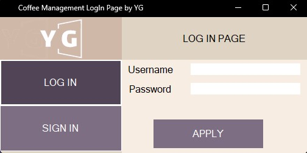

# Coffee Management App Using .NET Programming

Fully functioning Minimum Viable Product

Project has a log in and sign in page connected to sql server

User can use admin page to:

1- Create new item

2- Edit an existing item

3- Delete an existing item

4- Set table count

User can use user page to:

1- Set order to any table

2- Check each individual tables bill

3- Pay all the bill of the table

4- Seperate the bill for each person on table

Every table has its own database to store data, when admin change table count to higher number system auotmaticly create new data table for tables.
